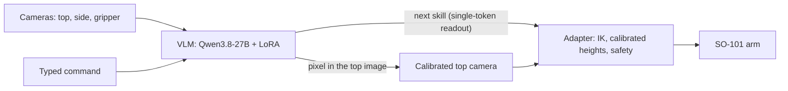

# SO-101 VLM Agent

**Discrete decisions with vision: a vision-language model fine-tuned only in simulation runs a real SO-101 arm.**

The model makes typed, discrete decisions (which skill comes next, where the object is, whether the task is done) and ordinary
code runs bounded motion primitives. It sees three camera images itself and points at objects in them. It was trained only
on simulated SO-101 episodes in MuJoCo: no teleoperation and no real-world training data.

On a real SO-101 on a home desk with three consumer cameras, one typed command, *"put the blue ball in the square container,
then put the yellow ball in the square container"*, completed in 104 seconds.

- **Model:** LoRA adapter for Qwen3.8-27B on Hugging Face (link in the model section below)
- **Write-up:** blog post and paper forthcoming

## How it works



At every step the agent receives the three 448×448 images, the command, the last step and its outcome, and the
gripper reading. It chooses one of nine skills: move to an object, grasp, lift, move to a place, rotate, release, open, done,
give up. The choice is a single-token readout at temperature 0. When a skill needs a position, the base model answers with a
pixel in the top image, and the calibrated camera model maps it to the table. Yes/no readouts check the scene before releasing
and before declaring the task done.

The adapter replaces the simulator's world on the real arm. It has an arm server (speed caps, watchdog, stop key), skills
(Cartesian moves with inverse kinematics, grasp to a calibrated height, lift, drop over a target, return to a parked pose),
camera and calibration tools, and a recorder that writes a three-camera video and a ledger line for every run.

## Results

**Simulation**, 600 photorealistic held-out test episodes (544 solvable):

| Task | Clean | With an injected fault |
|---|---|---|
| Put in a container | 29 / 30 | 42 / 46 |
| Take out of a container | 28 / 30 | 15 / 15 |
| Stack | 30 / 30 | 36 / 43 |
| Sort | 27 / 30 | 39 / 45 |
| **All solvable** | **199 / 240** | **220 / 269** |

Overall 440 / 544 (81%). It also gives up correctly on 54 / 56 unreachable episodes.

**Real SO-101**, 28 recorded runs over two days (a field report: the adapter changed between runs):

| Task | Result |
|---|---|
| Put one ball into the container | 6 of 9 valid runs, 61–164 s each |
| Put both balls into the container, one command | 1 of 4 full successes, in 104 s (one more reached the goal but ended with a wrong give-up) |
| Take a ball out of the container | 0 of 10 |

Most failures were in the layer between the model and the arm: calibration, motion primitives, workspace layout (a ±55° base
joint range) and hardware (a wrist camera's USB link). Taking balls out, especially from against a wall, is the open problem.

## Repository layout

| Path | What it is |
|---|---|
| `real/` | Real-arm adapter: arm server, skills (`arm.py`), cameras and camera server, calibration (`fullcal.py`, `height_probe.py`, `kin_cal.py`), runners (`run_real.py`, `run_task.sh`, `run_fast.sh`) |
| `run8/` | The agent loop used on the real arm (`run8/agent/agent.py`), the simulator evaluation (`run8/agent/run_cell.py`), the photoreal render server, model serving scripts |
| `run7/` | Prompts, the simulated world, and LoRA training (`run7/lora/`) for the released adapter |
| `run5/`, `run4/`, `run3/`, `run2/` | Earlier iterations that the agent still imports: the model client and readouts, reach maps, photoreal rendering and pointing, provider clients |
| `so101_vlm/` | Shared task code and the SO-101 MuJoCo model (`so101_vlm/assets/so101`, Apache-2.0) |
| `docs/` | Guides |

The run folders are successive iterations of one project; only the modules the current system imports are included here.

## Quick start: simulation

```sh
python3.12 -m venv .venv && . .venv/bin/activate
pip install -r requirements.txt
# the whole agent loop on the simulated arm with scripted decisions (no model, no GPU)
python -m real.run_real "" --backend sim --sim-task place_in --sim-seed 60000 --oracle --fast
```

## Running the model

Serve the base model with the adapter using vLLM on one GPU (we used an H100; see `run8/pods/start_model8.sh` for the exact
flags: FP8, CUDA graphs, `--enable-lora --lora-modules run7-v4=<adapter dir>`). The client reads the server's API key from
`~/.config/runpod/so101-run3-vllm-key` or the file named by `RUN3_KEY_FILE`. Then run the agent against the simulated arm:

```sh
python -m real.run_real "" --backend sim --sim-task place_in --sim-seed 60000 --base https://<your-server>
```

## Real arm

See [docs/REAL_ARM.md](docs/REAL_ARM.md) for the hardware, the arm and camera servers, the calibration procedure and safety.
In short:

```sh
export MODEL_BASE_URL=https://<your-server>
bash real/run_fast.sh "put the blue ball in the square container, then put the yellow ball in the square container"
```

## Training

`run7/lora/build_data.py` builds outcome-labelled examples from simulated rollouts (restore each state, try every candidate
step, finish with a scripted policy, score success minus 0.02 per step), and `run7/lora/train.py` trains the LoRA adapter
(rank 16, alpha 32, one epoch continued from an earlier adapter; see `run7/pods/train7.sh`). The training data and renders are
not included here because of their size.

## Limitations

This is research code from a two-day real-arm deployment. Real-world success depends heavily on camera calibration, the
motion primitives and the scene layout. Take-out tasks failed on the real arm, the calibration is only valid inside the
calibrated workspace, and the real-arm driver (`so101_twin`) is not part of this repository. Keep a hand near the stop key.

## License

Code: Apache-2.0 (see `LICENSE` and `NOTICE`). The SO-101 model assets in `so101_vlm/assets/so101` are Apache-2.0. The model
adapter is published separately with its own model card; the base model's license applies to it.
